<!--
  README.md — GitHub Profile
  Replace "your-github-username" throughout with your actual GitHub username
  for the stats widgets, snake animation, and visitor counter to work correctly.
-->

<div align="center">


<br/>

<a href="https://git.io/typing-svg">
  
</a>

<br/><br/>


<br/><br/>


</div>


<br/>

<!-- ================================================================== -->
<!-- ABOUT ME -->
<!-- ================================================================== -->

## `01` About Me


```yaml
whoami:
  name: "Shri"
  role: "Research Intern — Indian Institute of Technology Dharwad (IITDH)"
  location: "Karnataka, India"
  email: "Shrinivasamasalavada@gmail.com"

  current_research:
    - Intelligent Surveillance Systems
    - Computer Vision on Edge Devices
    - Thermal Imaging for Wildlife & Industrial Safety
    - Wireless Communication for Embedded Nodes

  philosophy: >
    Engineering systems that see, sense, and decide —
    at the intersection of AI and hardware.
```

<br clear="right"/>

<table>
<tr>
<td width="50%" valign="top">

### Interests


Artificial Intelligence &nbsp;·&nbsp; Computer Vision &nbsp;·&nbsp; Embedded Systems<br/>
Edge AI &nbsp;·&nbsp; Wireless Networking &nbsp;·&nbsp; Robotics<br/>
Wildlife Conservation &nbsp;·&nbsp; Industrial Safety &nbsp;·&nbsp; IoT<br/>
Machine Learning &nbsp;·&nbsp; Deep Learning &nbsp;·&nbsp; Generative AI &nbsp;·&nbsp; Data Analytics

</td>
<td width="50%" valign="top">

### Currently

```
[■■■■■■■■■□□]  Deep Learning for Vision       78%
[■■■■■■■□□□□]  Embedded Systems Design         62%
[■■■■■■■■□□□]  Research Paper Writing          70%
[■■■■■□□□□□□]  Wireless Sensor Networks        45%
[■■■■■■■■■□□]  System Integration              80%
```

</td>
</tr>
</table>


<!-- ================================================================== -->
<!-- RESEARCH -->
<!-- ================================================================== -->

## `02` Research

<div align="center">

<table>
<tr>
<th>Area</th>
<th>Focus</th>
<th>Stack</th>
</tr>
<tr>
<td><b>Intelligent Surveillance</b></td>
<td>Real-time human/object detection on low-power edge hardware</td>
<td>YOLO · OpenCV · Raspberry Pi</td>
</tr>
<tr>
<td><b>Thermal Imaging</b></td>
<td>Wildlife monitoring and industrial anomaly / hazard detection</td>
<td>Thermal Sensors · CV Pipelines</td>
</tr>
<tr>
<td><b>Wireless Communication</b></td>
<td>Low-latency sensor-to-node data links for distributed systems</td>
<td>ESP32 · IoT Protocols</td>
</tr>
<tr>
<td><b>Hardware-Software Integration</b></td>
<td>End-to-end pipelines from sensor input to embedded inference</td>
<td>C / C++ · Embedded Linux</td>
</tr>
</table>

</div>

### Current Focus

> Building a lightweight, real-time surveillance and thermal-detection pipeline
> deployable on Raspberry Pi class hardware — optimized for accuracy under
> strict power and compute constraints, for applications in wildlife
> conservation and industrial safety.


<!-- ================================================================== -->
<!-- TECH STACK -->
<!-- ================================================================== -->

## `03` Tech Stack

<div align="center">

**Programming**


**Artificial Intelligence**


**Embedded Systems**


**Tools & Platforms**


</div>


<!-- ================================================================== -->
<!-- EXPERIENCE TIMELINE -->
<!-- ================================================================== -->

## `04` Experience Timeline

```
2026 ── Research Intern, Indian Institute of Technology Dharwad (IITDH)
        │  Interdisciplinary research in AI-driven surveillance,
        │  computer vision, and embedded hardware integration.
        │
2025 ── Annular Solar Eclipse Science Program
        │  Collaborated with German exchange students on
        │  astronomy-based science outreach and observation.
        │
2025 ── National Level Science Exhibition — Vigyan Bhavan, New Delhi
        │  Presented original research at a national platform,
        │  representing interdisciplinary scientific work.
        │
20XX ── Foundations
           Began work in Python, embedded systems, and applied
           machine learning through self-driven projects.
```


<!-- ================================================================== -->
<!-- PROJECTS SHOWCASE -->
<!-- ================================================================== -->

## `05` Featured Projects

<div align="center">

<table>
<tr>
<td width="50%">

### Intelligent Surveillance System
Real-time object and human detection pipeline built for
low-power edge devices, combining YOLO-based inference with
optimized preprocessing for Raspberry Pi deployment.

`Python` `YOLO` `OpenCV` `Raspberry Pi`

[View Repository →](https://github.com/your-github-username)

</td>
<td width="50%">

### Thermal Wildlife Monitoring
Thermal-imaging based detection system designed for
non-intrusive wildlife observation and early hazard
identification in industrial environments.

`Thermal Imaging` `Computer Vision` `Embedded C`

[View Repository →](https://github.com/your-github-username)

</td>
</tr>
<tr>
<td width="50%">

### Wireless Sensor Node Network
Distributed sensor network built on ESP32 nodes for
low-latency environmental data collection and transmission.

`ESP32` `IoT` `Wireless Protocols`

[View Repository →](https://github.com/your-github-username)

</td>
<td width="50%">

### Industrial Safety Vision Pipeline
Computer vision pipeline for real-time hazard and PPE
compliance detection in industrial settings.

`Python` `OpenCV` `MediaPipe`

[View Repository →](https://github.com/your-github-username)

</td>
</tr>
</table>

</div>

<div align="center">

### Pinned Repositories


</div>


<!-- ================================================================== -->
<!-- GITHUB STATISTICS -->
<!-- ================================================================== -->

## `06` GitHub Statistics

<div align="center">


<br/>


</div>

<div align="center">

### Contribution Snake


<sub>Generated via <code>Platane/snk</code> GitHub Action — animates your real contribution graph.</sub>

</div>


<!-- ================================================================== -->
<!-- TROPHIES -->
<!-- ================================================================== -->

## `07` GitHub Trophies

<div align="center">


</div>


<!-- ================================================================== -->
<!-- ROADMAP / LEARNING -->
<!-- ================================================================== -->

## `08` Roadmap & Learning Progress

```mermaid
graph LR
    A[Foundations: Python / C / C++] --> B[Applied CV: OpenCV / YOLO]
    B --> C[Embedded AI: Raspberry Pi / ESP32]
    C --> D[Research: IIT Dharwad Internship]
    D --> E[Patent-Oriented Systems]
    E --> F[Advanced Edge AI Deployment]

    style A fill:#0d1117,stroke:#00F5FF,color:#c9d1d9
    style B fill:#0d1117,stroke:#00F5FF,color:#c9d1d9
    style C fill:#0d1117,stroke:#8A2BE2,color:#c9d1d9
    style D fill:#0d1117,stroke:#8A2BE2,color:#c9d1d9
    style E fill:#0d1117,stroke:#FF00A0,color:#c9d1d9
    style F fill:#0d1117,stroke:#FF00A0,color:#c9d1d9
```



<div align="center">

| Skill Track | Progress |
|---|---|
| Computer Vision & Deep Learning | ████████████████░░░░ 80% |
| Embedded Systems Engineering | █████████████░░░░░░░ 65% |
| Wireless & IoT Networking | ██████████░░░░░░░░░░ 50% |
| Research & Technical Writing | ██████████████░░░░░░ 70% |

</div>


<!-- ================================================================== -->
<!-- ACHIEVEMENTS -->
<!-- ================================================================== -->

## `09` Achievements

<div align="center">

<table>
<tr>
<td align="center" width="25%">
<br/>
<b>National Science Exhibition</b><br/>
<sub>Vigyan Bhavan, New Delhi</sub>
</td>
<td align="center" width="25%">
<br/>
<b>Solar Eclipse Program</b><br/>
<sub>Collaboration with German students</sub>
</td>
<td align="center" width="25%">
<br/>
<b>Research Internship</b><br/>
<sub>IIT Dharwad</sub>
</td>
<td align="center" width="25%">
<br/>
<b>Patent-Oriented Projects</b><br/>
<sub>Applied research to IP</sub>
</td>
</tr>
</table>

</div>


<!-- ================================================================== -->
<!-- PUBLICATIONS -->
<!-- ================================================================== -->

## `10` Publications

<div align="center">

| Title | Venue | Status |
|---|---|---|
| *Title to be added* | *Conference / Journal to be added* | In Progress |
| *Title to be added* | *Conference / Journal to be added* | Draft |

</div>

<!-- ================================================================== -->
<!-- PATENTS -->
<!-- ================================================================== -->

## `11` Patents

<div align="center">

| Title | Domain | Status |
|---|---|---|
| *Patent-oriented project — filing in progress* | Intelligent Surveillance / Embedded AI | Pending |

</div>

<!-- ================================================================== -->
<!-- CERTIFICATES -->
<!-- ================================================================== -->

## `12` Certificates

<div align="center">


</div>


<!-- ================================================================== -->
<!-- WAKATIME / HOLOPIN -->
<!-- ================================================================== -->

## `13` Coding Activity

<div align="center">

<!--START_SECTION:waketime-->
```text
c            ████████████████░░░░░░░░   78.4%
Python       ██████░░░░░░░░░░░░░░░░░░   62.1%
C++          ████░░░░░░░░░░░░░░░░░░░░   18.3%
Markdown     ██░░░░░░░░░░░░░░░░░░░░░░    5.0%
Other        █░░░░░░░░░░░░░░░░░░░░░░░    3.2%
```
<!--END_SECTION:waketime-->

<sub>Updated automatically via WakaTime GitHub Action</sub>

<br/><br/>

<a href="https://holopin.io">

</a>

</div>


<!-- ================================================================== -->
<!-- CONNECT -->
<!-- ================================================================== -->

## `14` Connect With Me

<div align="center">

<a href="mailto:Shrinivasamasalavada@gmail.com">

</a>
<a href="https://github.com/your-github-username">

</a>
<a href="https://linkedin.com/in/your-linkedin-username">

</a>
<a href="https://twitter.com/your-twitter-username">

</a>

<br/><br/>


</div>


<!-- ================================================================== -->
<!-- QUOTE -->
<!-- ================================================================== -->

<div align="center">

### <br/>


<br/>

*"Research is not about finding answers — it's about building systems<br/>that ask better questions of the world."*

<br/><br/>

</div>

<!-- ================================================================== -->
<!-- FOOTER -->
<!-- ================================================================== -->


<div align="center">
<sub>Built with intent · Continuously evolving · Last updated 2026</sub>
</div>
